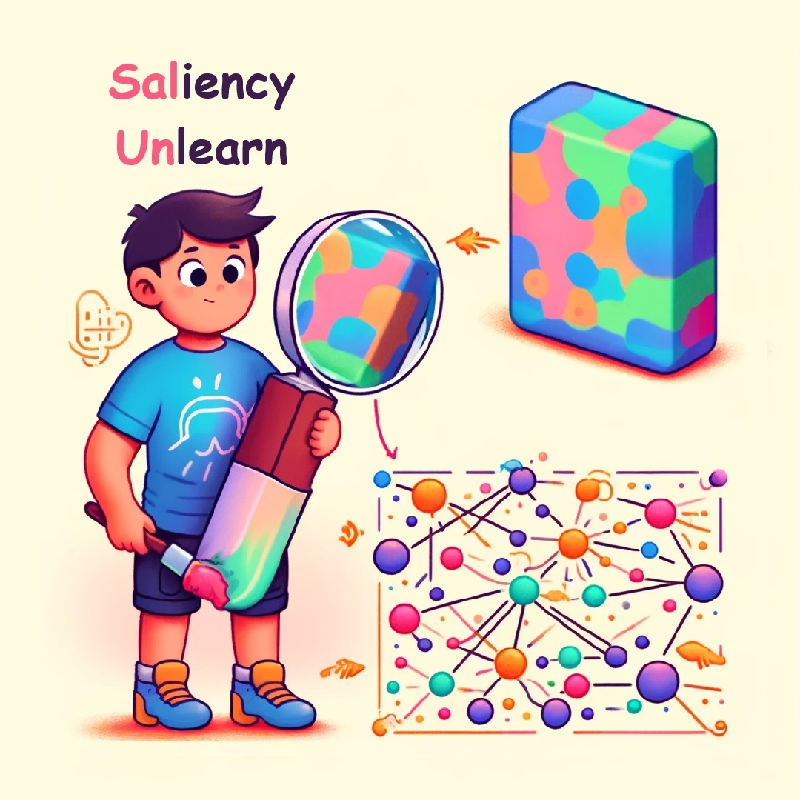

<div align='center'>
 
# SalUn: Empowering Machine Unlearning via Gradient-based Weight Saliency in Both Image Classification and Generation

**WARNING: This repository contains model outputs that may be offensive in nature.**

[](https://arxiv.org/abs/2310.12508)
[](https://youtu.be/O_K0wETC6jg)
[](https://www.optml-group.com/posts/salun_iclr24)
[](https://github.com/OPTML-Group/Unlearn-Saliency/issues)

[-blue)](https://iclr.cc/virtual/2024/poster/18130)
[](https://github.com/OPTML-Group/Unlearn-Saliency?tab=MIT-1-ov-file)
[](https://github.com/OPTML-Group/Unlearn-Saliency)
[](https://github.com/OPTML-Group/Unlearn-Saliency)
[](https://github.com/OPTML-Group/Unlearn-Saliency)
</div>


<table align="center">
  <tr>
    <td align="center"> 
       
    </td>
  </tr>
</table>

This is the official code repository for the ICLR 2024 Spotlight paper [SalUn: Empowering Machine Unlearning via Gradient-based Weight Saliency in Both Image Classification and Generation](https://arxiv.org/abs/2310.12508).

<table align="center">
  <tr>
    <td align="center"> 
       
      <br>
      <em style="font-size: 18px;">  <strong style="font-size: 18px;">Figure 1:</strong> Example comparison of pre/after unlearning by SalUn. <br/> (Left) Concept "Nudity"; (Middle) Object "Dog"; (Right) Style "Sketch".</em>
    </td>
  </tr>
</table>

## News ## 
:mega: Feel free to check out our [new work](https://github.com/OPTML-Group/Unlearn-Simple) about **a simple but effective unlearning method** for LLMs!

:mega: Check out our [ICML 2025 paper](https://github.com/OPTML-Group/Unlearn-Smooth) on making LLM unlearning more robust through smoothness optimization!

## Abstract

With evolving data regulations, machine unlearning (MU) has become an important tool for fostering trust and safety in today's AI models. However, existing MU methods focusing on data and/or weight perspectives often suffer limitations in unlearning accuracy, stability, and cross-domain applicability. To address these challenges, we introduce the concept of 'weight saliency' for MU, drawing parallels with input saliency in model explanation. This innovation directs MU's attention toward specific model weights rather than the entire model, improving effectiveness and efficiency. The resultant method that we call *saliency unlearning* (SalUn) narrows the performance gap with 'exact' unlearning (model retraining from scratch after removing the forgetting data points). To the best of our knowledge, SalUn is the first principled MU approach that can effectively erase the influence of forgetting data, classes, or concepts in both image classification and generation tasks. As highlighted below, For example, SalUn yields a stability advantage in high-variance random data forgetting, *e.g.*, with a 0.2% gap compared to exact unlearning on the CIFAR-10 dataset. Moreover, in preventing conditional diffusion models from generating harmful images, SalUn achieves nearly 100% unlearning accuracy, outperforming current state-of-the-art baselines like Erased Stable Diffusion and Forget-Me-Not.


<table align="center">
  <tr>
    <td align="center"> 
       
      <br>
      <em style="font-size: 18px;">  <strong style="font-size: 18px;">Figure 2:</strong> Schematic overview of our proposal on Saliency Unlearning (SalUn).</em>
    </td>
  </tr>
</table>

## Getting Started
SalUn can be applied to different tasks such as image classification and image generation. You can click the link below to access a more detailed installation guide.
* [SalUn for Image Classification](Classification/README.md)
* SalUn for Image Generation
  * [Classifier-free Guidance DDPM](DDPM/README.md)
  * [Stable Diffusion](SD/README.md)

## Examples of Unlearning on Stable Diffusion

See our [project page](https://www.optml-group.com/posts/salun_iclr24) for more visualizations!

<table align="center">
  <tr>
    <td align="center"> 
       
      <br>
      <em style="font-size: 18px;">  <strong style="font-size: 18px;">Figure 3:</strong> Class-wise unlearning by SalUn on Stable Diffusion for the "Church" class.</em>
    </td>
  </tr>
</table>

<table align="center">
  <tr>
    <td align="center"> 
       
      <br>
      <em style="font-size: 18px;">  <strong style="font-size: 18px;">Figure 4:</strong> Concept unlearning by SalUn on Stable Diffusion for the "Nudity" concept.</em>
    </td>
  </tr>
</table>

## Contributors

* [Chongyu Fan](https://a-f1.github.io/)
* [Jiancheng Liu](https://ljcc0930.github.io/)

## Cite This Work
```
@article{fan2023salun,
  title={SalUn: Empowering Machine Unlearning via Gradient-based Weight Saliency in Both Image Classification and Generation},
  author={Fan, Chongyu and Liu, Jiancheng and Zhang, Yihua and Wong, Eric and Wei, Dennis and Liu, Sijia},
  journal={arXiv preprint arXiv:2310.12508},
  year={2023}
}
```
